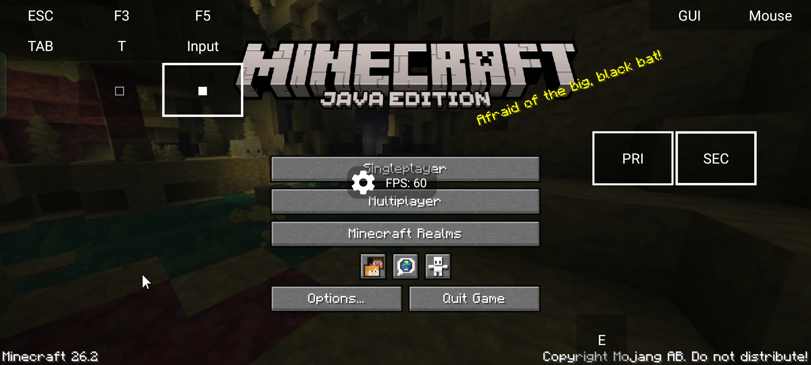

# Turtle Launcher

> **A modern, futuristic, high-performance Android launcher for Minecraft Java Edition.**

Turtle Launcher is a next-generation Android Minecraft launcher designed around speed, stability, and premium user experience. Built with modern Android technologies and inspired by Zalith launcher, it combines powerful customization with an elegant Material 3 interface.

Unlike traditional launcher forks, Turtle Launcher introduces a completely refreshed visual identity, fluid animations, advanced performance optimizations, and a polished ecosystem for playing Minecraft Java on Android.

---

# ✨ Highlights

* 🚀 Fast and lightweight
* 🎮 Gaming-inspired interface
* 🎨 Beautiful Material Design 3 UI
* ⚡ Performance optimized
* 🧩 Full mod loader support
* 📦 Instance management
* ☁ Modern download system
* 🔧 Advanced launcher controls
* 📱 Optimized for phones and tablets
* 🌙 Dark mode designed from the ground up

---

# 📱 Features

## Modern User Interface

* Material Design 3
* Glassmorphism effects
* Dynamic color themes
* Adaptive layouts
* Edge-to-edge design
* Smooth page transitions
* Premium animations
* Responsive UI
* Landscape & portrait support
* Tablet optimized layouts
* Modern settings dashboard
* Gaming-style home screen
* Minimal and clean design
* Dynamic blur effects
* Immersive experience

---

## ⚡ Performance

Designed to minimize overhead while maximizing gameplay performance.

### Launcher Optimizations

* Extremely fast startup
* Low RAM consumption
* Efficient image caching
* Hardware accelerated UI
* Optimized rendering pipeline
* Reduced animation overhead
* Background task optimization
* Intelligent memory management
* Lazy loading components
* Smooth scrolling
* Faster instance loading
* Optimized downloads
* Low battery usage
* Reduced UI jank

### Minecraft Optimizations

* Better launch speed
* Improved Java initialization
* Optimized JVM configuration
* Configurable RAM allocation
* Stable FPS
* Reduced loading times
* Efficient resource management

---

# 🎮 Minecraft Support

Supports a wide range of Minecraft versions and modding platforms.

### Versions

* Release
* Snapshot
* Old Beta
* Old Alpha

### Mod Loaders

* Fabric
* Quilt
* Forge
* NeoForge

### Content Management

* Mods
* Resource Packs
* Shader Packs
* Datapacks
* Worlds
* Saves
* Screenshots
* Logs

---

# 🧰 Launcher Features

## Instance Manager

* Multiple game installations
* Independent configurations
* Version isolation
* Easy backup
* Import & export
* Duplicate instances

## Java Manager

* Install Java automatically
* Manage multiple Java runtimes
* Java version detection
* Custom Java selection
* Runtime verification

## Account Manager

* Offline accounts
* Microsoft login
* Ely.by account

## Download Center

* Minecraft downloads
* Mod loader downloads
* Asset downloads
* Library downloads
* Java downloads
* Resume support

## Launch System

* Live launch logs
* Crash logs
* Exit code reporting
* Error diagnostics
* Debug mode

---

# 🎨 Customization

Personalize every part of the launcher.

* Dynamic themes
* Accent colors
* Wallpapers
* Custom backgrounds
* Icon customization
* Font selection
* UI density options
* Animation controls
* Launcher appearance presets

---

# ⚙ Advanced Settings

Power users can fine-tune performance.

* RAM allocation
* JVM arguments
* Renderer settings
* Resolution scaling
* Performance profiles
* FPS optimization
* Cache management
* Experimental features
* Debug options

---

# 📊 Design Philosophy

Turtle Launcher is built around six core principles:

* 🚀 Fast
* 🎨 Beautiful
* ⚡ Smooth
* 🛡 Stable
* 🎮 Immersive
* 🧩 Customizable

The objective is to create a launcher that feels closer to a modern gaming console dashboard than a traditional Android application.

---

# 🏗 Technical Stack

## Languages

* Kotlin
* Java

## Android

* Jetpack Compose
* Material Design 3
* AndroidX
* Coroutines
* Flow
* ViewModel
* Navigation

## Libraries

* Coil
* Lottie
* CommonMark
* GL4ES
* Mesa3D
* LWJGL3
* OpenJDK

---

# 🎯 Optimization Goals

Every release focuses on improving:

* Faster startup
* Lower memory usage
* Reduced CPU usage
* Better battery efficiency
* Faster downloads
* Stable gameplay
* Smooth animations
* Responsive interface
* Reduced loading screens
* Consistent frame pacing

---

# 🖼 Screenshots

| Screenshots            |
| -----------------------|
|  |

More screenshots will be added as development progresses.

---

# 📦 Roadmap

## Current

* Modern UI
* Performance improvements
* Instance management
* Theme engine

## Planned

* Cloud synchronization
* Skin/Cape manager
* [Turtle Client](https://modrinth.com/mod/turtleclient)

---

# 🤝 Contributing

Contributions are welcome.

If you'd like to improve Turtle Launcher:

1. Fork the repository
2. Create a feature branch
3. Commit your changes
4. Open a Pull Request

Bug reports, feature requests, and suggestions are always appreciated.

---

# 📄 License

This project is licensed under the **GNU General Public License v3.0 (GPL-3.0)**.

See the `LICENSE` file for more information.

---

# ❤️ Acknowledgements

Turtle Launcher builds upon the excellent work of the open-source Minecraft launcher community.

## Based on ideas and technologies from

* PojavLauncher
* Zalith Launcher
* HMCL
* Boardwalk
* OpenJDK
* LWJGL
* Mesa3D
* GL4ES

Huge thanks to every developer and contributor behind these incredible projects.

---

# 📚 Third-Party Libraries

### PojavLauncher

* Boardwalk (JVM Launcher)
* Android Support Library
* GL4ES
* OpenJDK
* LWJGL3
* LWJGLX
* Mesa3D
* pro-grade
* bhook
* libepoxy
* virglrenderer

### Zalith Launcher

* HMCL
* CommonMark
* AndroidViewAnimations
* TapTargetView

Please refer to each library's respective license for detailed information.

---

# ⚠ Disclaimer

Turtle Launcher is an independent open-source project.

It is **not affiliated with, endorsed by, or sponsored by Mojang Studios or Microsoft.**

Minecraft is a trademark of Mojang Studios. All rights belong to their respective owners.

---

## ⭐ Support the Project

If you enjoy Turtle Launcher:

* ⭐ Star this repository
* 🐛 Report bugs
* 💡 Suggest features
* 🤝 Contribute code
* 📢 Share the project

Every contribution helps make Turtle Launcher even better.
