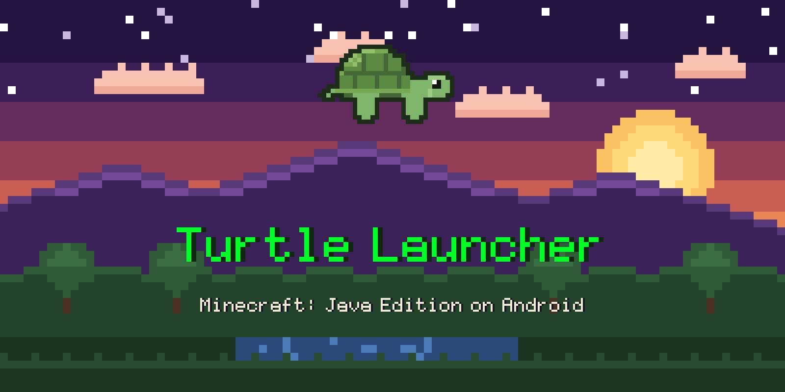

# Turtle Launcher

<H1 ALIGN= "CENTER">A modern, high-performance Android launcher for Minecraft: Java Edition.</H1>

Turtle Launcher is a fast, beautiful, and feature-rich Minecraft Java launcher built for Android. Inspired by the open-source launcher **Zalith Launcher**, it combines a modern Material 3 interface with powerful customization, performance optimizations, and extensive modding support.

---

## ✨ Features

### 🎨 Modern UI

* Material Design 3
* Dynamic themes & accent colors
* Smooth animations
* Responsive phone & tablet layouts
* Dark mode
* Gaming-inspired interface

### 🚀 Performance

* Fast startup
* Low RAM usage
* Optimized rendering
* Hardware-accelerated UI
* Intelligent memory management
* Stable FPS & faster launches

### 🎮 Minecraft Support

* Release, Snapshot, Beta & Alpha
* Fabric
* Quilt
* Forge
* NeoForge

### 📦 Content Management

* Mods
* Resource Packs
* Shader Packs
* Datapacks
* Worlds
* Screenshots
* Logs

### 🛠 Launcher Tools

* Multiple instances
* Java Manager
* Microsoft, Offline, Battly & Ely.by accounts
* Download Manager
* Live launch & crash logs
* Backup, import & export

### ⚙ Customization

* Custom backgrounds
* UI scaling
* Animation controls
* Performance profiles
* JVM & RAM settings

---

## 🏗 Built With

* Kotlin & Java
* Jetpack Compose
* Material Design 3
* AndroidX
* Coroutines & Flow
* Coil
* Lottie
* LWJGL 3
* GL4ES
* Mesa3D
* OpenJDK

---

## 🎯 Goals

* Faster startup
* Lower memory usage
* Better battery efficiency
* Smooth gameplay
* Stable frame pacing
* Modern user experience

---

## 🗺 Roadmap

### Completed

- [X] Modern UI
- [x] Theme engine
- [x] Instance Manager
- [x] Ai intregation
- [x] Performance improvements
- [x] Mesa3D
- [x] LTW Renderer
- [x] MobileGlues Renderer
- [x] Cleanroom Integration
- [x] Terracotta Integration
- [x] mclo.gs Integration

### Current

- [ ] Cloud Sync
- [x] Skin & Cape Manager
- [ ] Turtle Client integration
- [x] Replace OSMesa with a real EGL implementation

---

## FAQs
## 1. Is Turtle Launcher Safe?
### -> Yes — Turtle Launcher is safe to use. The source code is fully open on GitHub under the GPL-3.0 license. As always, only download the APK from trusted sources, like the official GitHub releases page..
## 2. Is Turtle Launcher free?
### -> Yes! Turtle Launcher is completely free to use, with no ads and no premium paywall.
## 3. Does Turtle Launcher support Minecraft mods?
### -> Yes. Turtle Launcher supports Fabric, Quilt, Forge and NeoForge, and you can install mods directly through the built-in mod Explorer.
## Does it require a Microsoft account?
### No. Turtle Launcher supports Microsoft, offline, Battly and Ely.by accounts, so you can play the way you prefer.
---

## 🤝 Contributing

Contributions are welcome! Feel free to submit issues, feature requests, or pull requests.

---

## 📄 License

Licensed under **GPL-3.0**.

---

## ❤️ Credits

Built upon ideas and technologies from:

* PojavLauncher
* Zalith Launcher
* HMCL
* Boardwalk
* OpenJDK
* LWJGL
* Mesa3D
* GL4ES

Special thanks to all open-source contributors who make Android Minecraft possible.

---

## ⚠ Disclaimer

Turtle Launcher is an independent open-source project and is **not affiliated with Mojang Studios or Microsoft**.

Minecraft is a trademark of Mojang Studios.

---

## ⭐ Support

If you enjoy Turtle Launcher:

* ⭐ Star the repository
* 🐞 Report bugs
* 💡 Suggest features
* 🤝 Contribute code
* 📢 Share the project

Every contribution helps make Turtle Launcher better.
